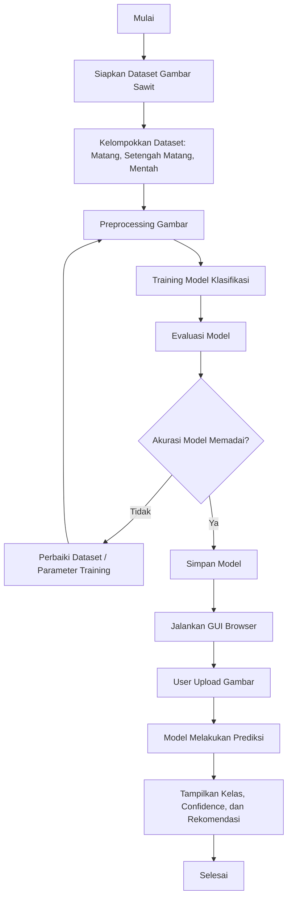
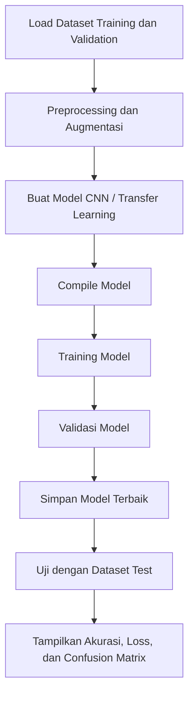
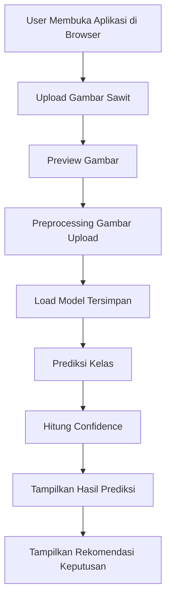

# Flow Sistem Pendeteksi Pemilihan Bibit Unggul Sawit

Dokumen ini menjelaskan alur kerja sistem pendeteksi pemilihan bibit unggul sawit berbasis citra menggunakan dataset dengan 3 kelas:

- `matang`
- `setengah_matang`
- `mentah`

Sistem dibuat menggunakan bahasa pemrograman Python dan ditampilkan melalui GUI berbasis browser.

## 1. Tujuan Sistem

Sistem ini bertujuan untuk membantu proses identifikasi kondisi sawit berdasarkan gambar. Hasil klasifikasi digunakan sebagai pendukung keputusan dalam pemilihan sawit yang layak atau tidak layak berdasarkan kategori kematangan.

Output utama sistem:

- Prediksi kelas gambar: `matang`, `setengah_matang`, atau `mentah`
- Nilai confidence atau tingkat keyakinan model
- Rekomendasi keputusan berdasarkan hasil prediksi

## 2. Teknologi yang Digunakan

Rekomendasi teknologi:

- Python sebagai bahasa pemrograman utama
- TensorFlow/Keras atau PyTorch untuk pembuatan model machine learning
- OpenCV/Pillow untuk pemrosesan gambar
- NumPy dan Pandas untuk pengolahan data
- Matplotlib untuk visualisasi hasil training
- Streamlit sebagai GUI berbasis browser

Streamlit direkomendasikan karena mudah digunakan untuk membuat tampilan web lokal tanpa perlu membuat backend dan frontend terpisah.

## 3. Struktur Dataset

Dataset disusun berdasarkan folder kelas seperti berikut:

```text
dataset/
  train/
    matang/
    setengah_matang/
    mentah/
  validation/
    matang/
    setengah_matang/
    mentah/
  test/
    matang/
    setengah_matang/
    mentah/
```

Keterangan:

- `train`: data untuk melatih model
- `validation`: data untuk validasi saat proses training
- `test`: data untuk menguji performa akhir model

Contoh pembagian data:

- 70% data training
- 20% data validation
- 10% data testing

## 4. Alur Sistem Secara Umum



## 5. Alur Preprocessing Dataset

Preprocessing dilakukan agar gambar memiliki format yang konsisten sebelum masuk ke model.

Langkah preprocessing:

1. Membaca gambar dari folder dataset.
2. Mengubah ukuran gambar, misalnya menjadi `224x224` piksel.
3. Mengubah format warna jika diperlukan.
4. Normalisasi nilai piksel dari `0-255` menjadi `0-1`.
5. Melakukan augmentasi data agar model lebih kuat terhadap variasi gambar.

Contoh augmentasi:

- Rotasi gambar
- Flip horizontal
- Zoom ringan
- Perubahan brightness
- Pergeseran posisi gambar

## 6. Alur Training Model



Rekomendasi model:

- CNN sederhana untuk dataset kecil
- MobileNetV2, EfficientNet, atau ResNet untuk transfer learning

Jika dataset masih terbatas, transfer learning lebih disarankan karena biasanya lebih stabil dibanding membuat CNN dari awal.

## 7. Alur Prediksi di GUI Browser



Contoh tampilan fitur GUI:

- Tombol upload gambar
- Preview gambar yang dipilih
- Hasil prediksi kelas
- Confidence model
- Rekomendasi keputusan
- Riwayat prediksi sederhana jika diperlukan

## 8. Logika Rekomendasi Keputusan

Logika rekomendasi dapat dibuat seperti berikut:

```text
Jika hasil prediksi = matang:
  Status = Layak / Direkomendasikan

Jika hasil prediksi = setengah_matang:
  Status = Perlu Pemeriksaan Lanjutan

Jika hasil prediksi = mentah:
  Status = Tidak Direkomendasikan
```

Contoh output:

```text
Kelas Prediksi : matang
Confidence     : 92.45%
Rekomendasi    : Layak / Direkomendasikan
```

## 9. Rancangan Struktur Project

```text
sistem-pendeteksi/
  dataset/
    train/
    validation/
    test/
  models/
    model_sawit.h5
  src/
    train.py
    predict.py
    preprocessing.py
  app.py
  requirements.txt
  flow.md
```

Keterangan file:

- `app.py`: aplikasi GUI browser menggunakan Streamlit
- `src/train.py`: script untuk training model
- `src/predict.py`: script untuk prediksi gambar
- `src/preprocessing.py`: fungsi preprocessing gambar
- `models/model_sawit.h5`: model hasil training
- `requirements.txt`: daftar library Python yang dibutuhkan

## 10. Alur Penggunaan Aplikasi

1. User menjalankan aplikasi dengan perintah:

```bash
streamlit run app.py
```

2. Browser terbuka dan menampilkan halaman aplikasi.
3. User mengunggah gambar sawit.
4. Sistem menampilkan preview gambar.
5. Model memproses gambar dan melakukan klasifikasi.
6. Sistem menampilkan hasil prediksi.
7. User melihat rekomendasi keputusan.

## 11. Contoh Pseudocode Sistem

```python
load_model("models/model_sawit.h5")

image = upload_image_from_browser()
processed_image = preprocess(image, size=(224, 224))

prediction = model.predict(processed_image)
class_name = get_highest_class(prediction)
confidence = get_confidence_score(prediction)

recommendation = make_recommendation(class_name)

show_result_to_user(class_name, confidence, recommendation)
```

## 12. Evaluasi Model

Model perlu dievaluasi dengan metrik berikut:

- Accuracy
- Precision
- Recall
- F1-score
- Confusion matrix

Evaluasi penting untuk mengetahui apakah model sering salah membedakan kelas `matang`, `setengah_matang`, dan `mentah`.

## 13. Catatan Implementasi

- Gunakan gambar dengan pencahayaan yang cukup dan objek sawit terlihat jelas.
- Pastikan jumlah gambar tiap kelas relatif seimbang.
- Jika akurasi rendah, tambahkan dataset dan lakukan augmentasi.
- Simpan model terbaik agar aplikasi browser tidak perlu training ulang setiap dijalankan.
- GUI browser sebaiknya hanya digunakan untuk prediksi, sedangkan training dilakukan melalui script terpisah.

## 14. Ringkasan Alur Akhir

```text
Dataset gambar sawit
-> Preprocessing
-> Training model klasifikasi
-> Evaluasi model
-> Simpan model
-> Jalankan aplikasi browser
-> Upload gambar
-> Prediksi kelas
-> Tampilkan hasil dan rekomendasi
```
